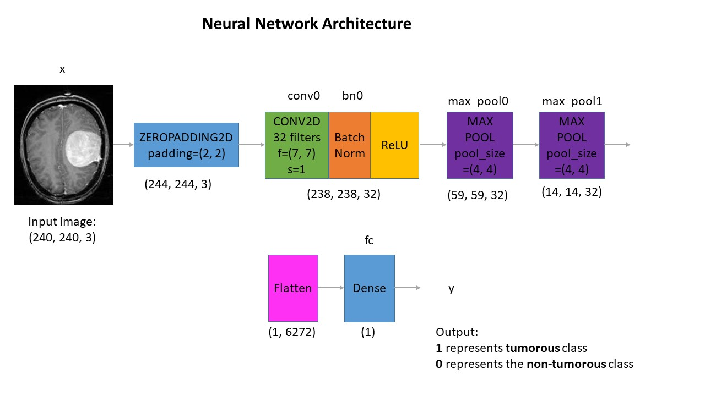
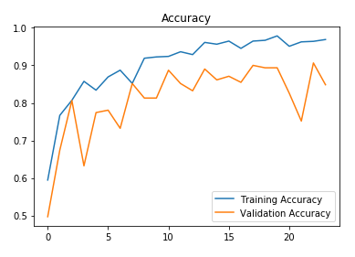
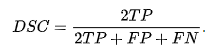

# brain tumor detection


content on brain-tumor-detection contain:
- [requirements for installation](#requirements)
- [journal](#paper)
- **brain tumor detection using convolutional networks**
    - [about the data](#about-the-data)
    - [data split](#data-split)
    - [neural network architecture](#neural-network-architecture)
    - [training the model](#training-the-model)
    - [convolutional networks test result](#convolutional-networks-test-result)
- **tensorflow and pytorch implementation on brain tumor detection**
    - [overview with keras & torch implementation](#overview-with-keras-and-torch-implementation)
    - [UNet testing](#unet-test)
    - [PSPNet testing](#pspnet-test)
    - [deeplab testing](#deeplab-test)
    - [dataset](#datasets)
    - [data augmentation](#data-augmentation)
    - [preprocess](#preprocess)
    - [train](#train)
    - [result](#result)
- [reference](#reference)

## requirements:
- [tensorflow](https://www.tensorflow.org/install)
- [PyTorch](https://pytorch.org/)

## paper:
[brain tumor and survival prediction - Arfy slowy](https://drive.google.com/file/d/1n4aWlVFN3ExYEh4VZWXhYfqLD5eLLspL/view?usp=sharing)

## about the data
the datasets contain 2 folders : yes and no wich contains 253 brain MRI images. the folder yes contains 155 brain MRI images that are tumorous and the folder no contains 98 Brain MRI images that are non tumorous

## data preprocessing
For every image, the following preprocessing steps were applied:
1. crop the part of the image that contains only the brain (which is the most important part of the image)
2. resize the image to have shape of (240, 240, 3) = (image_width, image_height, number_of_channels) beause images in the datasets come in different size. so, all images should have the same shape to feed it as an input to the neural network
3. apply normalization to scale pixel value to the range 0-1

## data split
the data split in the following
 - 70% of the data for training
 - 15% of the data for validation
 - 15% of the data for testing

## neural network architecture
<p align = 'center'>
    
</p>

Each input x (image) has a shape of (240, 240, 3) and is fed into the neural network. and, it goes through the following layers
- a zero padding layer with a pool size of (2, 2)
- a convolutional layer with 32 filter, with filter size of (7, 7) and stride equal to 1
- a batch normalization layer to normalize pixel values to speed up computation
- a ReLu activation layer
- a max pooling layer with ```f = 4``` and ```s = 4```
- a max pooling layer with ```f = 4``` and ```s = 4``` same as before
- a flatten layer in order to flatten the ```3-dimensional matrix``` into a ```one-dimensional vector```
- a dense (output unit) fully connected layer with one neuron with a sigmoid activation (since this is a binary classification task)

**why this architecture**

i applied transfer learning using ResNet and ```vgg-16``` but these models were too complex to data size and were overfitting, of course, you may get good result applying transfer learning with these models using data augmentation, i'm using training on computer with AMD ryzen 7 4800H and 16GB memory. so, i had to take into consideration computational complexity and memory limitations

## training the model
the model was trained for 24 epochs and these are the loss and accuracy plots




## convolutional networks test result

**88.7%** accuracy on the test set
**0.88** f1 score on the test set

|             | Validation set | Test set      |
| :---        |    :----:      |          ---: |
| Accuracy    | **91%**        | **98%**       |
| F1 score    | **0.91**       | **0.88**      |

- the code in the ipython notebooks
- the weights for all the models. the best model is named as ```cnn-parameters-improvement-23-0.91.model```
- the model are stored as ```.model``` they can be restored by: 
```python
from tensorflow.keras.models import load_model
best_model = load_model(filepath='models/cnn-parameters-improvement-23-0.91.model')
```
- the original data in folder named ```yes``` and ```no```.


## overview with keras and torch implementation
### with keras implementation on brain tumor detection
 
\
brain complete tumor segmentation
### core predicition:

\
brain core tumor segmentation

[brain-tumor-detection](https://drive.google.com/file/d/1n4aWlVFN3ExYEh4VZWXhYfqLD5eLLspL/view?usp=sharing) focusing on the evaluation of state-of-the-art methods for segmentation of brain tumors in multimodal magnetic resonance imaging (MRI) scans. brain-tumor-detection utilizes multi-institutional pre-operative MRI and focuses on the segementation of intrinsically heterogenerous (in appearance, shape, and histology) brain tumors, namely gliomas. Furthermore, to pinpoint the clinical relevance of this segmentation task, brain-tumor-detection also focuses on the prediction of patient overall survival, via integrative analyses of radiomic features and artificial intelligence (machine learning) algorithms.

## unet test
```bash
pytorch/models/unet.py
```
<p align = 'center'>
    
</p>
<!--  -->

## pspnet test
```bash
pytorch/models/pspnet.py
```
<p align = 'center '>
    
</p>

## deeplab test
```bash
pytorch/models/deeplab.py
```
<p align = 'center'>
    
</p>

# datasets
<p align ='center'>
 
</p>

**information**:
 - flair = channel0 is background
 - T1 = channel1 is necrotic and non-enhancing tumor
 - T1c = channel2 is edema
 - T2 = channel3 is enhancing tumor

## data augmentation
<p align = 'center'>
    
    
</p>

**running code**
```bash
pytorch/preproces.py
```
```bash
pytorch/dataset.py
```

## preprocess
on ```preprocess.py``` code for data pre-processing. using this, the original image (240 x 240 x 155 x 4) can be divided into 155 image pieces (240 x 240) of the spesific mode. also, original label (240 x 240 x 155) can be divided into 155 label pieces.

## dataset
on ```dataset.py``` code for preparing dataset and dataloader for [pytorch](https://pytorch.org/docs/stable/index.html) modules

# train
## Loss function
dice coefficient loss information [here](https://pytorch.org/docs/stable/index.html)
<p align = 'center'>
    
</p>

## optimizer
adam optimizer information [here](https://arxiv.org/pdf/1412.6980.pdf)
stochastic gradient descent [here](https://en.wikipedia.org/wiki/Stochastic_gradient_descent)

## Hyperparameter
learning rate = ```1e-4```
maximum number of epochs = ```100```
weights init : normal distribution ```(mean : 0, std: 0.01)```
bias init : ```initialized as 0```

## train test
```bash
pytorch/train.py
```
```bash
pytorch/utils.py
```

on ```train.py``` code for training model and getting several inputs
on ```utils.py``` code for loss function, utlis function, ui functions, and etc

**testing**
```bash
pytorch/test.py
```
running code for testing MRI inputs

# Result
## prediction
<p align = 'center'>
    
    <br>
    <p align = 'center'> brain complete tumor segmentation </p>
</p>
<p align = 'center'>
    
    
    <p align = 'center'> brain core tumor segmentation </p>
</p>


## reference
 - [convolutional networks for biomedical image segmentation](https://arxiv.org/pdf/1505.04597.pdf)
 - [pyramid scene parsing network](https://arxiv.org/pdf/1612.01105.pdf)
 - [encoder - decoder with atrous separable convolution for semantic image segmentation](https://arxiv.org/pdf/1612.01105.pdf)